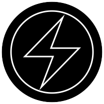

# Energis Token Contracts

Tackling climate change with blockchain

[Zero Carbon Project][Energis Link] can work with the crypto-community to make a difference and provide leadership by accelerating the transition to zero carbon emissions. Our vision is to see global carbon emissions reduce to zero in fifteen years.

Many energy consumers are concerned about climate change but believe that green electricity is too expensive and their contribution won't make much difference.

Energy consumers from the crypto-community can participate in our zero carbon markets to reduce their energy costs, contribute to tackling climate change and earn valuable Energis crypto-currency.

## Contracts

Please see the [contracts/](contracts) directory.

[Energis Link]: https://www.zerocarbonproject.com/
